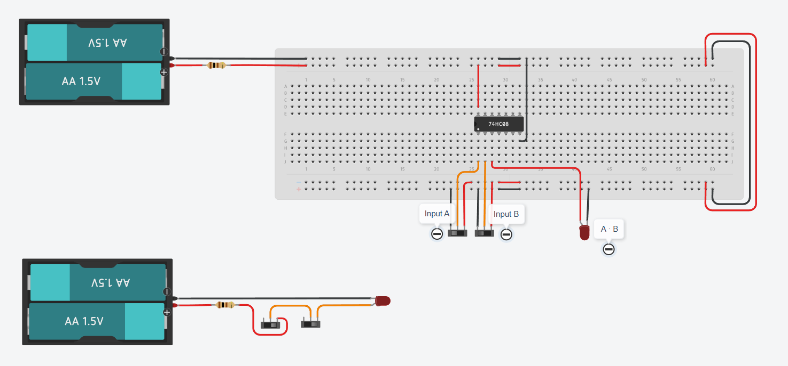
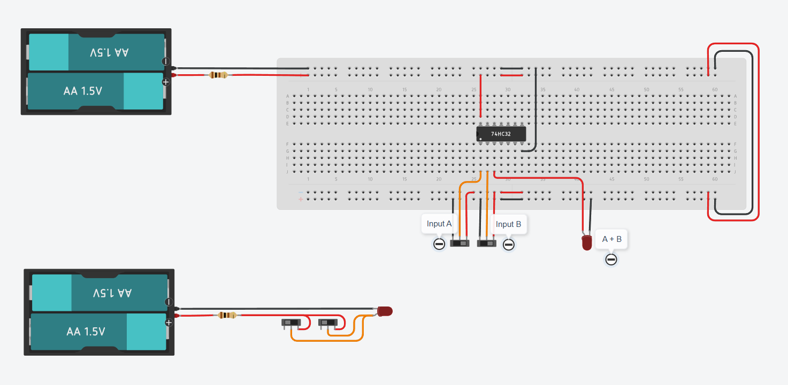
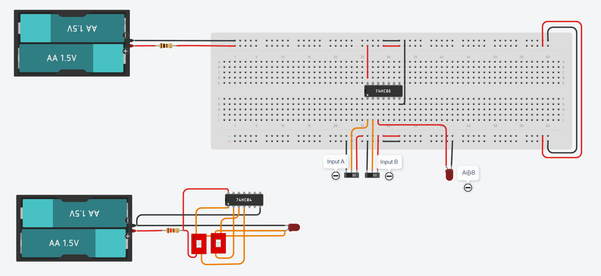
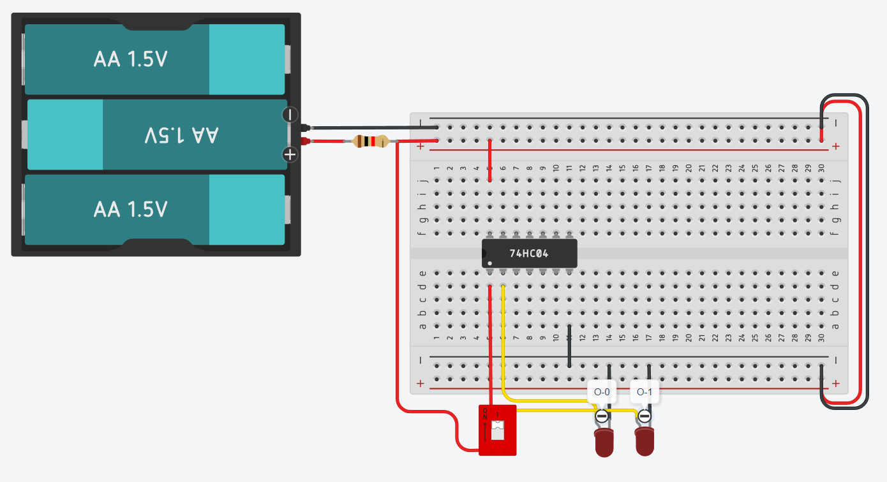
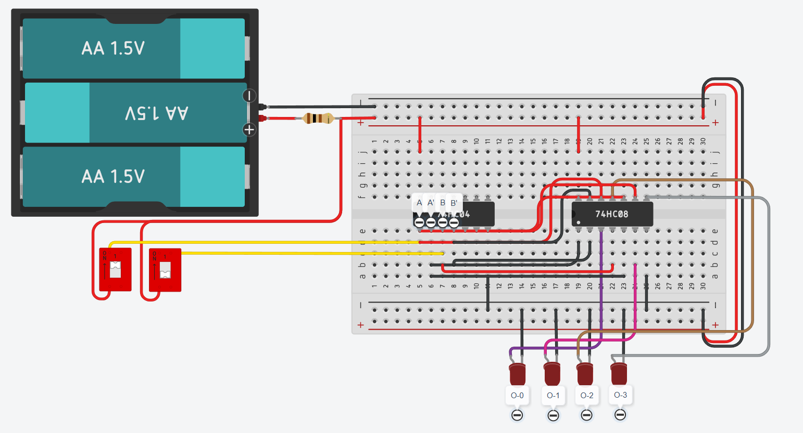

# ShortCircuit

Short Circuit is a collection of digital logic circuits created during my undergraduate coursework at Sister Nivedita University, along with a few extra circuits built for practice and experimentation.

---

## Circuits

### 1. AND Gate

A basic 2 input AND gate. The output becomes 1 only when both inputs are 1. The circuit includes two versions, one using a logic IC and another using discrete components to show how the behaviour is formed.

Truth Table

| A | B | A・B |
| - | - | --- |
| 0 | 0 | 0   |
| 0 | 1 | 0   |
| 1 | 0 | 0   |
| 1 | 1 | 1   |

:link: [Circuit Link](https://www.tinkercad.com/things/lMhdsFxjJ3i-de-and-gate?sharecode=Ctde8SG5hnuPZKSWxEjlwRR4zDA0VlAItpBrn_j3aA8)

### 2. OR Gate

A 2 input OR gate. The output becomes 1 when either one or both inputs are 1. This circuit is shown once with a logic IC and once with individual components to illustrate how the logic works.

Truth Table

| A | B | A + B |
| - | - | ----- |
| 0 | 0 | 0     |
| 0 | 1 | 1     |
| 1 | 0 | 1     |
| 1 | 1 | 1     |

:link: [Circuit Link](https://www.tinkercad.com/things/4mCLiMjrFG0-de-or-gate?sharecode=_F_BoAkUHw8MoZetXgRxyMlWKxbw2iYydsQmgEEFR6w)

### 3. XOR Gate

A 2 input XOR gate that outputs 1 only when the inputs are different. The circuit includes an IC based build and a discrete component build to show how XOR logic is formed from simpler gates.

Truth Table

| A | B | A ⊕ B |
| - | - | ----- |
| 0 | 0 | 0     |
| 0 | 1 | 1     |
| 1 | 0 | 1     |
| 1 | 1 | 0     |

:link: [Circuit Link](https://www.tinkercad.com/things/28rgFeqQ8ms-de-xor-gate?sharecode=vl7U6SoqcamW8oVzSZbXmGZU1Vdh74HEby9cFOHVJyU)

### 4. 1x2 Decoder

A 1 to 2 line decoder where a single input selects one of two output lines. When the input is 0, the first output goes high. When the input is 1, the second output goes high.

Truth Table

| Input | 0  | 1  |
| ----- | -- | -- |
| 0     | 1  | 0  |
| 1     | 0  | 1  |

:link: [Circuit Link](https://www.tinkercad.com/things/0hQQ4QUdCDh-de-1x2-decoder?sharecode=4oyfs64rABptuub27uHsKDJUxRW_kxgbLLSFmNG6xbo)

### 5. 2x4 Decoder

A 2x4 decoder that activates one of four outputs based on a 2 bit input. The two inputs form a binary number from 0 to 3 and the corresponding output line turns on.

Truth Table

| I0 | I1 | 0 | 1 | 2 | 3 |
| -- | -- | - | - | - | - |
| 0  | 0  | 1 | 0 | 0 | 0 |
| 0  | 1  | 0 | 1 | 0 | 0 |
| 1  | 0  | 0 | 0 | 1 | 0 |
| 1  | 1  | 0 | 0 | 0 | 1 |

:link: [Circuit Link](https://www.tinkercad.com/things/lHm2o2tF0Sb-de-2x4-decoder?sharecode=54N5dXCUwdaNgnwRlvArcxrxoHhp5_s-v0Sf0Ey2Brg)

### 6. Half Adder

A half adder that performs single bit binary addition using two inputs. It produces a Sum output and a Carry output. The Sum follows XOR logic and the Carry follows AND logic.

Truth Table

| A | B | Sum | Carry |
| - | - | --- | ----- |
| 0 | 0 | 0   | 0     |
| 0 | 1 | 1   | 0     |
| 1 | 0 | 1   | 0     |
| 1 | 1 | 0   | 1     |

:link: [Circuit Link](https://www.tinkercad.com/things/djO0JRCZlFQ-half-adder?sharecode=nHbua6GCca8FO22P36khPcKoQLthDx1t50c0SLJ5gEs)

## Other links

All my circuits can be found here
[https://www.tinkercad.com/users/d74BBzmoxcw?type=circuits](https://www.tinkercad.com/users/d74BBzmoxcw?type=circuits)
